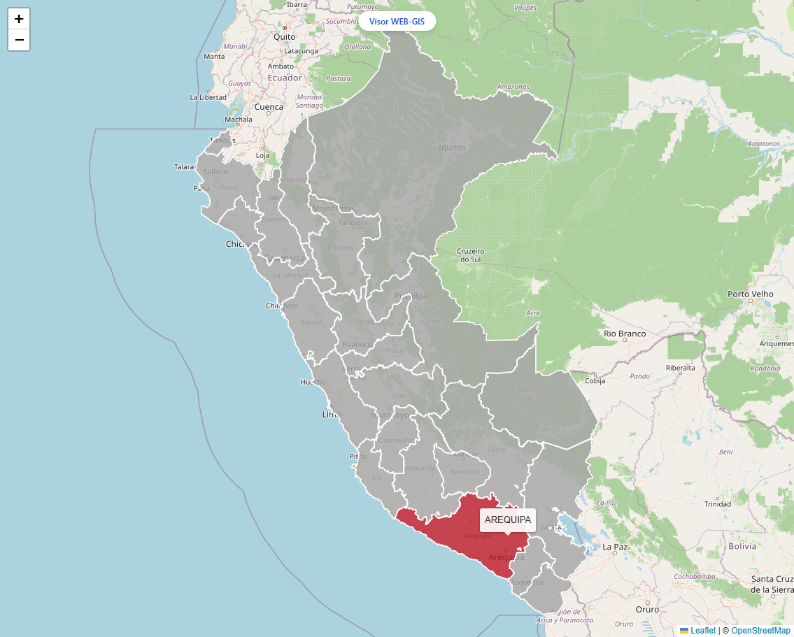
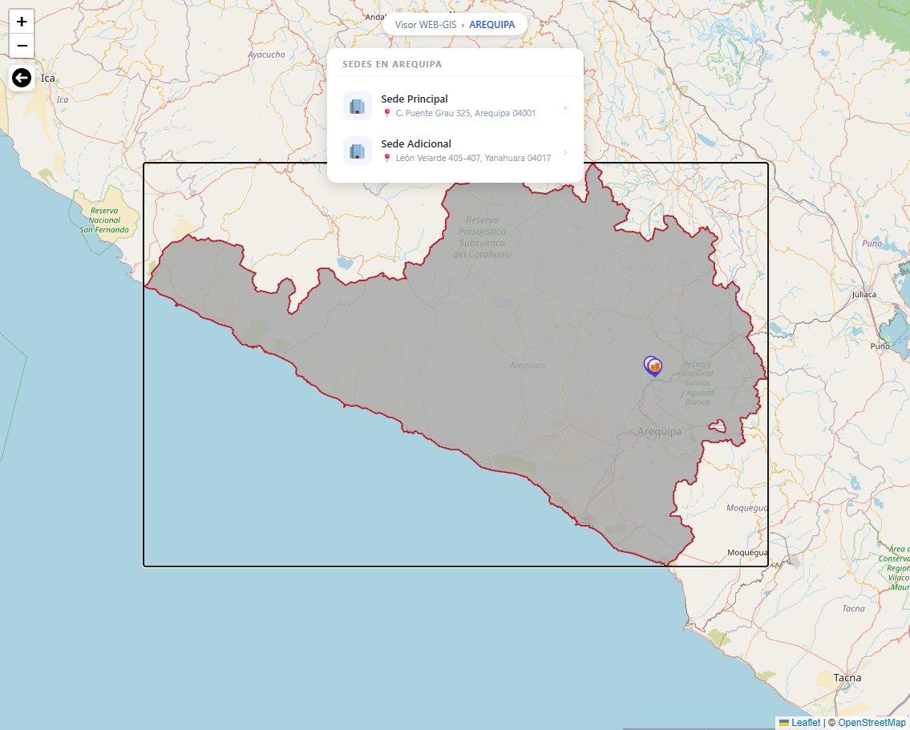
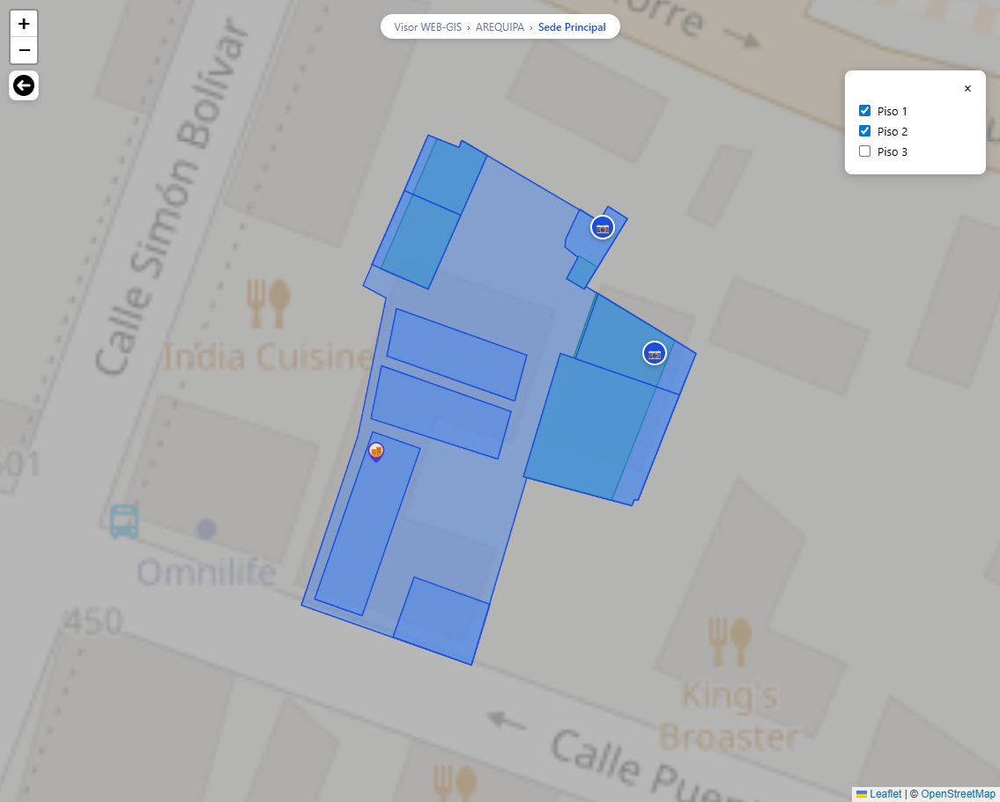

# Web GIS Platform

## Overview
A full-stack web mapping application that visualizes geospatial data and georeferenced photos in real time.

## Tech Stack
- Frontend: React
- Backend: Node.js, Express
- Database: SqlLite (Prisma)
- Maps: (Leaflet)

## Features
- Interactive map visualization
- Geospatial data rendering
- REST API for data access
- Real-time updates (if applies)

## Architecture
Client → API → Database

## Live Demo
https://sencico-visorweb-gis-frontend.onrender.com/

- Back: Render
- Front: Render

## Screenshots
### Map View

### Ubications

### Photos

## How to Run
cd backend
npm install
npm run dev

cd frontend
npm install
npm start
